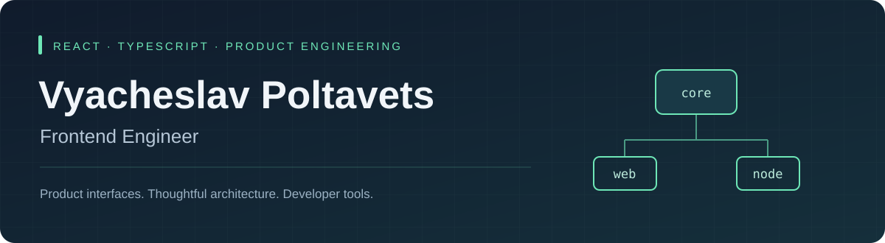

  <a href="https://t.me/vapoltavecs"><strong>Написать в Telegram ↗</strong></a>
  &nbsp;&nbsp;·&nbsp;&nbsp;
  <a href="https://github.com/engagementlabs/appss-sdk-js"><strong>Посмотреть SDK ↗</strong></a>

## Привет, я Вячеслав

Frontend-разработчик с **4+ годами коммерческого опыта**. Создаю интерфейсы на React и TypeScript, проектирую архитектуру приложений и инструменты для разработчиков.

Работал с B2B- и B2C-продуктами, Telegram Mini Apps, аналитикой и интерактивной графикой. В работе беру ответственность за весь путь задачи: от уточнения требований и выбора решения до релиза и поддержки.

**Сейчас открыт к предложениям по frontend-разработке · React / TypeScript · удалённо.**

## Проект, с которого стоит начать

### [APPSS SDK →](https://github.com/engagementlabs/appss-sdk-js)

Аналитический SDK для **Telegram Mini Apps, веб-приложений и Node.js**. Спроектировал архитектуру и реализовал SDK; развиваю его вместе с участниками проекта.

| Архитектура | Надёжность | Разработка |
| :--- | :--- | :--- |
| Ports & Adapters; отдельные пакеты `core`, `browser`, `node` | Пакетная отправка событий, повторные попытки, сохранение очереди в браузере | TypeScript, Turbo, Vitest, автоматизация релизов |

Общее ядро отделено от платформенных транспортов и хранилищ. В браузере используются `sendBeacon` и `localStorage`; в Node.js есть обработка завершения процесса и интеграции с Telegram-ботами.

[Репозиторий](https://github.com/engagementlabs/appss-sdk-js) · [Browser package](https://www.npmjs.com/package/@appss/sdk-browser) · [Node package](https://www.npmjs.com/package/@appss/sdk-node) · Apache-2.0

## Что я делал в продуктах

- **Frontend продукта:** архитектура React-приложения, разработка функций, интеграции с API и выпуск в production.
- **Инструменты команды:** внутренний фреймворк для повторного использования решений при создании Telegram-игр.
- **Производительность интерфейсов:** виртуализация сложных таблиц, оптимизация скролла и анимаций.
- **Взаимодействие в команде:** обсуждение требований, совместное проектирование с backend-разработчиками, code review и менторинг.

## Технологии

| Направление | Инструменты и практики |
| :--- | :--- |
| Frontend | **TypeScript, JavaScript, React, Next.js**, HTML, CSS |
| Архитектура | Feature-Sliced Design, Ports & Adapters, монорепозитории |
| Качество и поставка | Vitest, Jest, GitHub Actions, CI/CD |
| Платформы и графика | Telegram Mini Apps, Node.js, Pixi.js, Canvas, Lottie |

В публичных репозиториях также есть ранние учебные проекты и эксперименты. Основной актуальный пример моей инженерной работы — APPSS SDK.

---

**Обсудим вашу задачу или вакансию?** [Напишите мне в Telegram →](https://t.me/vapoltavecs)
